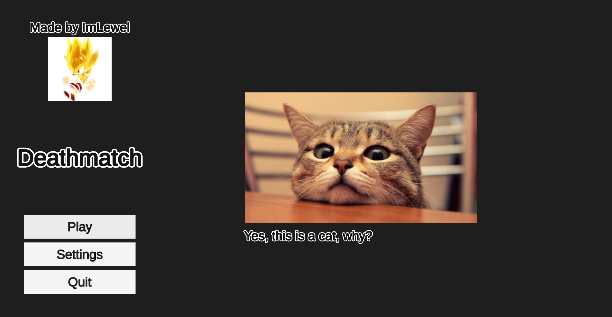
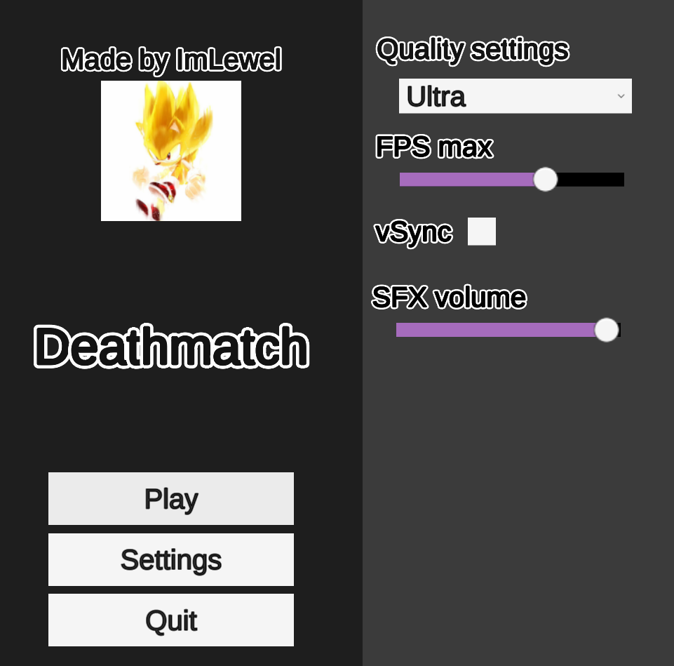
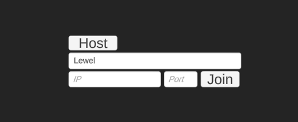
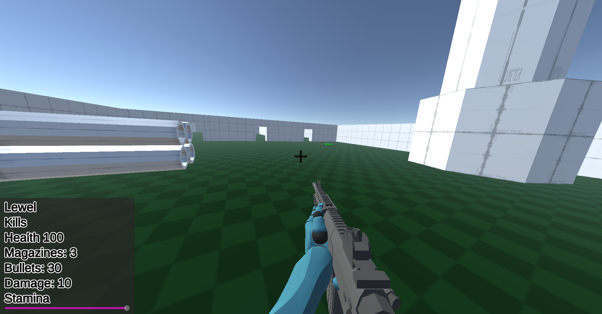
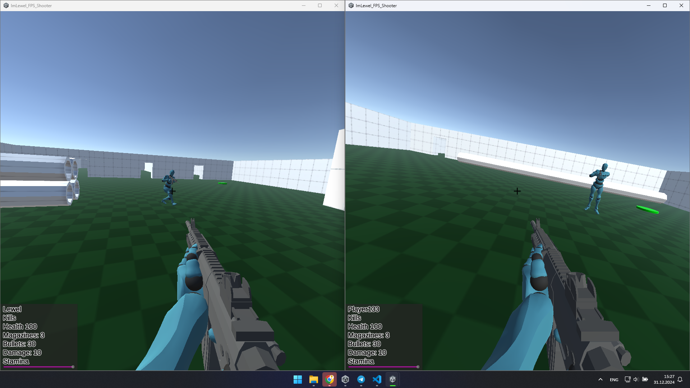
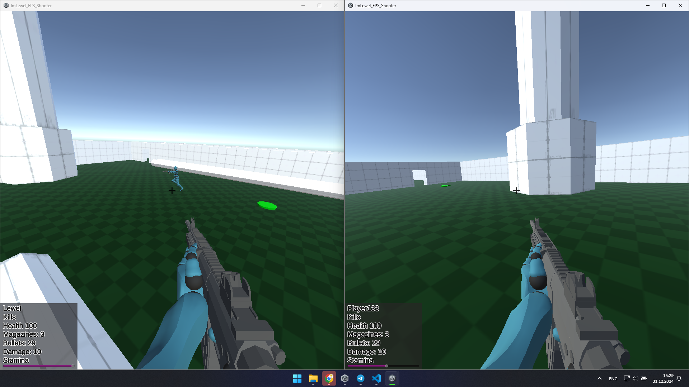
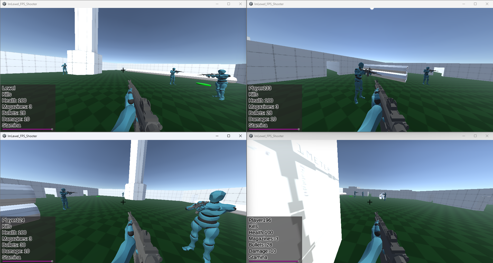

# FPS Shooter by ImLewel
It is simple indie shooter written in ```C#```, created in ```Unity```. Currently Deathmatch is main game mode available with this package, in future updates there will be more game modes and more updates for them.
# Plans on project
## Deathmatch:
* Team Deathmatch as second option
* More movement
* More animations
* More sounds
* Netcode rework (switch to another netcode library or working under current one)
* Huge codebase refactoring

## Survival mode:
* Bot's logic
* Multiplayer
* Vehicles
* Animations
* Graphics and models (in process, switch from prototype player object to normal human player object)
* Sounds (partially done, added sounds for walking, running, jumping, reloading and shooting)
* Physics changes (moved from RigidBody, now movement feels smoother)
* Scoping
* Laying and moving in this pose
* More weapons (imported assets, will be combined with my modularity system)
* Guns customization (was in process recently, already done some scripts, responsible for modularity of weapons, currently freezed)
* Nice inventory

# Controls
* ```WASD``` - move player
* ```Left control``` - crouch
* ```Space``` - jump
* ```Left shift``` - sprint
* ```Left mouse button``` - shoot

# P.S.
* Project is in early alpha (or even pre alpha), however you can play it; 
* Plan list will shrink or grow during development;
* If you want to support my project or contribute/collaborate contact me using any way, described in my profile, you prefer best!
* You can also suggest any idea not mentioned in the list or describe your opinion at some point how you see it;
* Development takes a lot of time even to implement some small feature, because I have to consider about perfomance, further impacts on gaming process and also development process, make tests and debug. But I'm trying my best to improve game every commit I make ^_^

# To get my project
```git clone https://github.com/ImLewel/ImLewel_FPS_Shooter``` in the terminal<br>
Or<br>
Click green ```Code``` button and select any convenient way

# Some in-game screenshots












